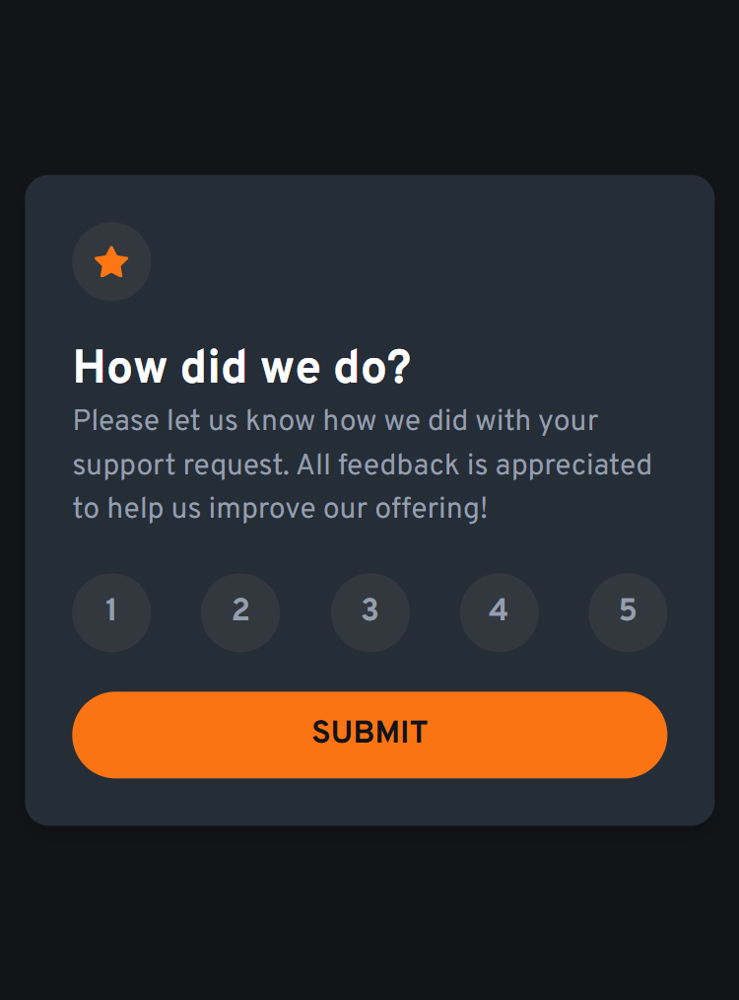
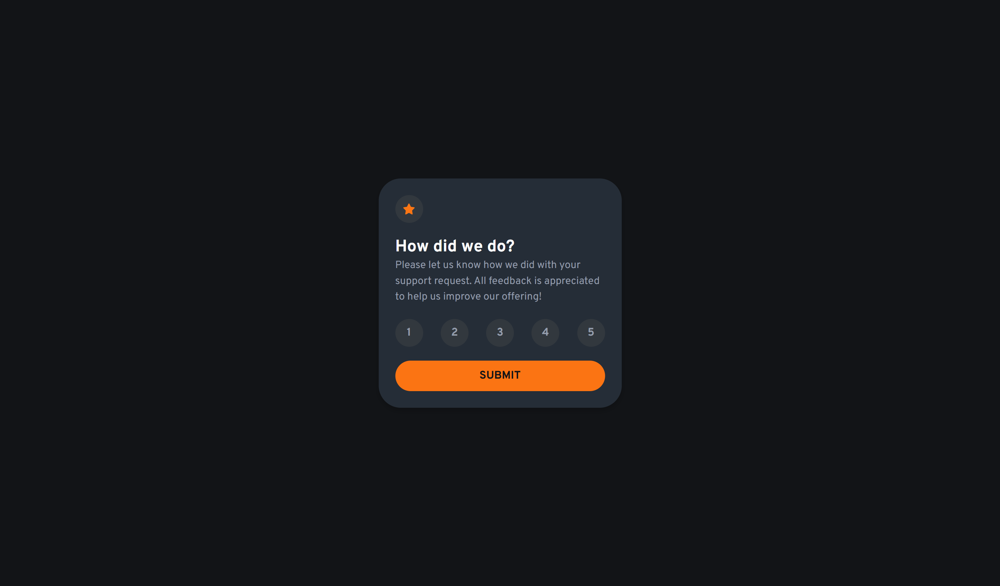
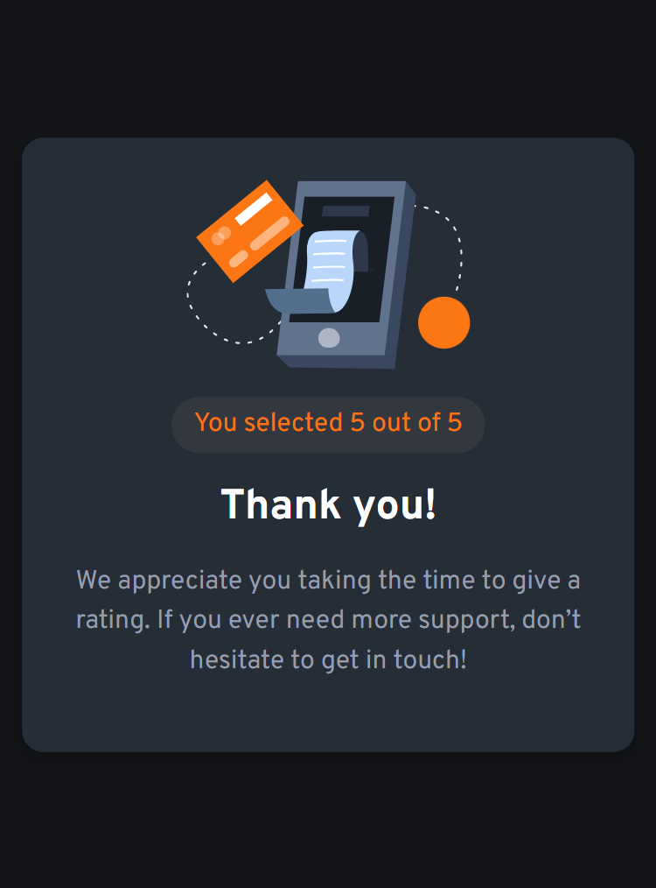

# Frontend Mentor - Interactive rating component solution

This is a solution to the [Interactive rating component challenge on Frontend Mentor](https://www.frontendmentor.io/challenges/interactive-rating-component-koxpeBUmI). Frontend Mentor challenges help you improve your coding skills by building realistic projects.

## Table of contents

- [Overview](#overview)
  - [The challenge](#the-challenge)
  - [Screenshot](#screenshot)
  - [Links](#links)
- [My process](#my-process)
  - [Built with](#built-with)
  - [What I learned](#what-i-learned)
  - [Continued development](#continued-development)
  - [Useful resources](#useful-resources)

## Overview

This project is an interactive rating component built as part of a Frontend Mentor challenge. The goal was to create a user-friendly interface where users can select a rating from 1 to 5 and submit their feedback. Upon submission, the component displays a thank you message along with the selected rating. The solution focuses on responsive design, accessibility, and smooth user interactions, making it suitable for both desktop and mobile devices.

### The challenge

Users should be able to:

- View the optimal layout for the app depending on their device's screen size
- See hover states for all interactive elements on the page
- Select and submit a number rating
- See the "Thank you" card state after submitting a rating

### Screenshot

### Links

- Solution URL: [https://github.com/remainhumble/Interactive-rating-component]
- Live Site URL: [https://remainhumble.github.io/Interactive-rating-component/]

## My

## My process

I started by analyzing the challenge requirements and designing the component structure. The rating buttons were implemented with accessible HTML elements and keyboard navigation support. I then tested the component on different screen sizes and refined the UI for smooth transitions and clear feedback.

### Built with

- Semantic HTML5 markup
- CSS custom properties
- Flexbox
- Mobile-first workflow

### What I learned

Throughout this project, I deepened my understanding of accessible UI design and responsive layouts. I learned how to use ARIA attributes to improve screen reader support for interactive elements, and how to manage focus states for better keyboard navigation.

One key takeaway was handling dynamic state changes in JavaScript to update the UI based on user input. For example, toggling between the rating selection and the thank you message:

I also practiced using CSS custom properties for theming and maintaining consistent styles:

Overall, this project reinforced the importance of accessibility, clean code structure, and responsive design principles.

### Continued development

In future projects, I want to continue improving my skills in the following areas:

- **Advanced accessibility techniques:** I plan to deepen my understanding of ARIA roles, keyboard navigation, and screen reader compatibility to ensure my components are usable by everyone.
- **State management in JavaScript:** I aim to refine my approach to handling dynamic UI changes, especially in more complex applications where multiple states interact.
- **Performance optimization:** I will focus on optimizing load times and responsiveness, particularly for mobile devices and slower networks.

By concentrating on these areas, I hope to build more robust, accessible, and user-friendly interfaces in my future work.

### Useful resources

- [Deepseek](https://chat.deepseek.com/) - Deepseek is an AI-powered coding assistant that helped me debug issues and understand complex code snippets during this project.
- [Common accessibility best practices](https://www.frontendmentor.io/learning-paths/introduction-to-web-accessibility-mXu-9PHVsd/steps/68b6a34b242fbf360832e0ec/article/read) - This isn’t an exhaustive list by any means, but these are sound foundational principles to keep in mind as I build this project.

## Author

- Frontend Mentor - [@remainhumble](https://www.frontendmentor.io/profile/remainhumble)
- X(formerly Twitter) - [@thiflan120699](https://x.com/thiflan120699)
